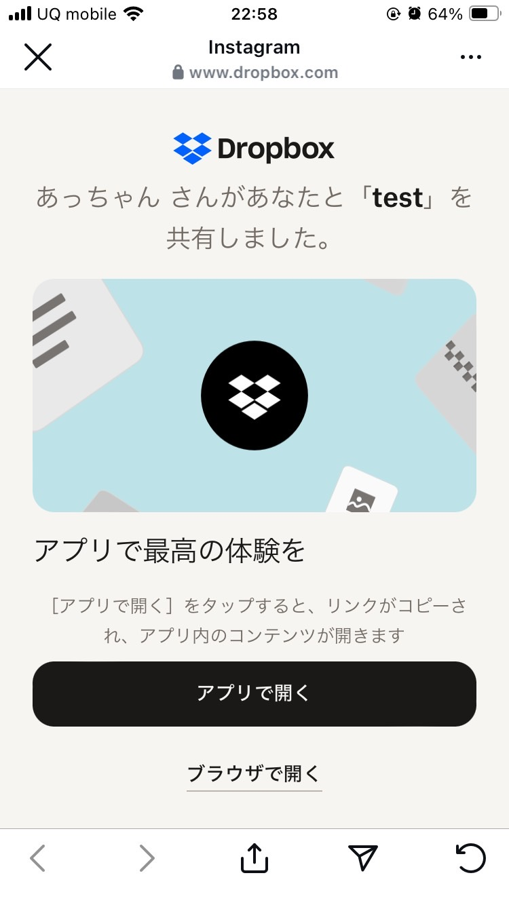
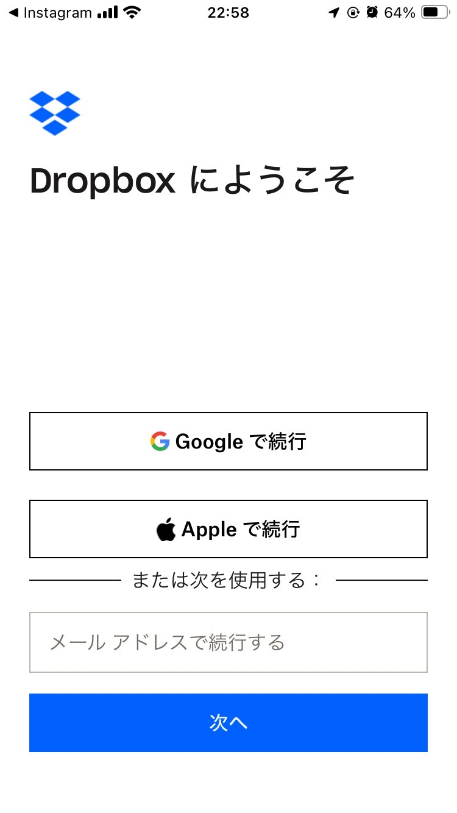
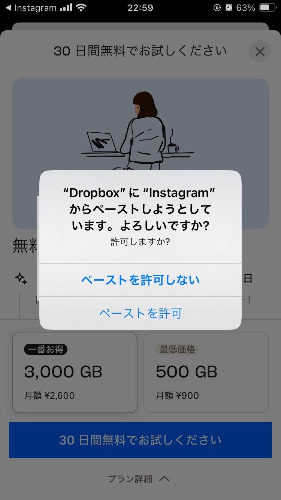
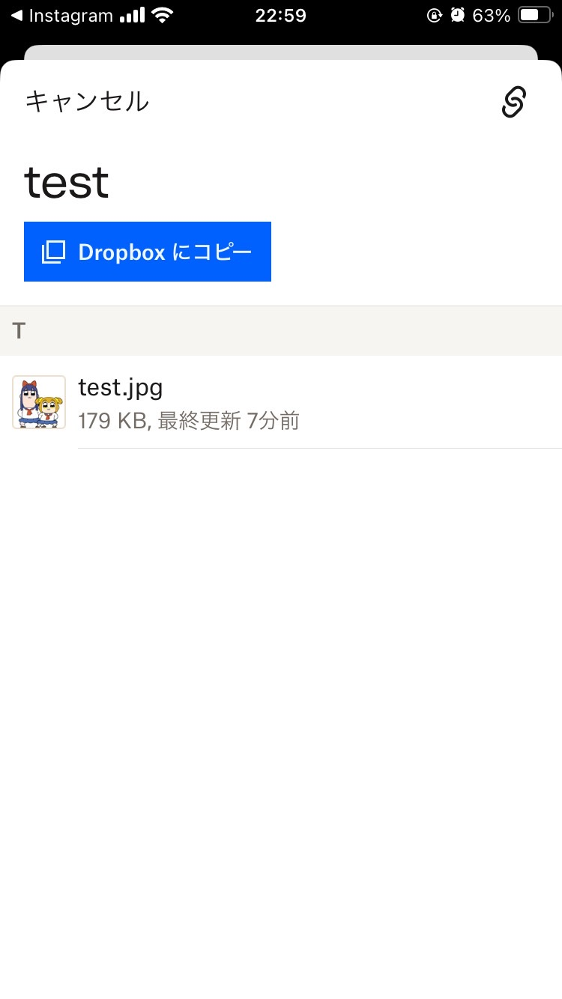
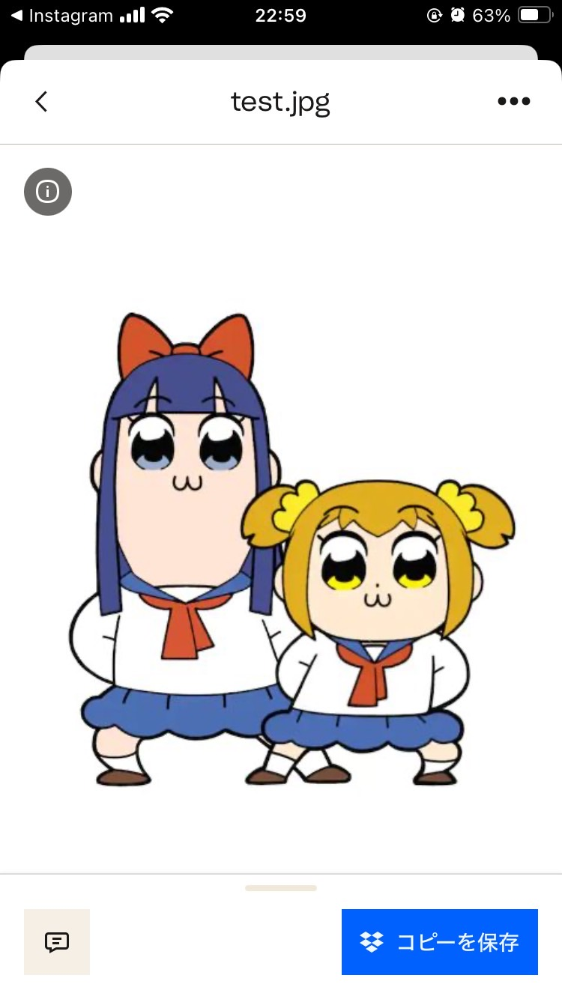
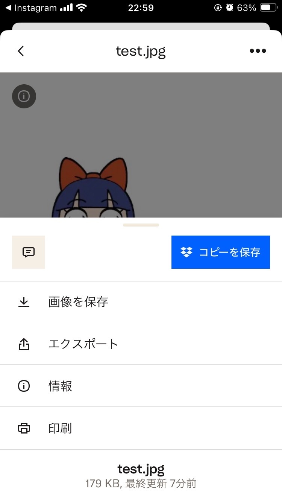
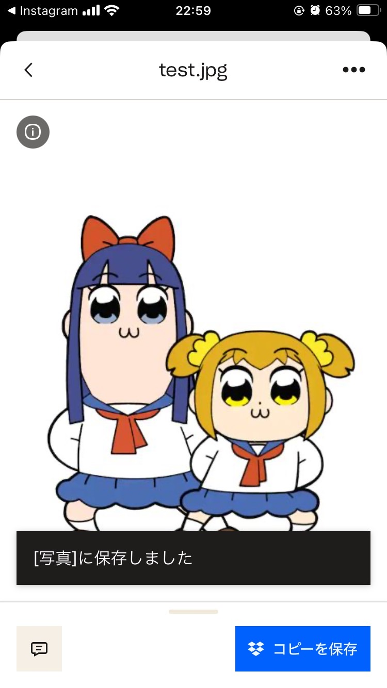

# プレゼント企画 写真のダウンロードについて

## はじめに

InstageamのDMで送付した画像は圧縮されて低画質となってしまうため、印刷するとぼやけることがあります。
そのため、高画質版はDropboxというクラウドストレージ経由での配布とさせて頂いております。
お手数ですが、以下の手順に従ってダウンロードしてください。

## 高画質版 ダウンロード手順

### 1. Dropboxアプリのインストール

お手持ちのスマートフォンの機種に応じて、以下のリンクからアプリをダウンロードしてください

- Android : https://play.google.com/store/apps/details?id=com.dropbox.android&hl=ja
- iPhone : https://apps.apple.com/jp/app/dropbox-%E3%83%95%E3%82%A1%E3%82%A4%E3%83%AB%E3%82%B9%E3%83%88%E3%83%AC%E3%83%BC%E3%82%B8-%E3%82%AF%E3%83%A9%E3%82%A6%E3%83%89%E3%83%89%E3%83%A9%E3%82%A4%E3%83%96/id327630330

### 2. プレゼント企画のリンクをタップ

お手持ちのスマートフォンにDropboxアプリがインストールされた状態で、先ほど送付したリンクをタップしてください。
次のような画面が表示されますので、「アプリで開く」をタップしてください。

### 3. アプリで画像を開く

一時的にDropboxのアカウントを作成して頂く必要があります。
iPhoneの方はAppleで、Androidの方はGoogleで続行を選択してください

このような画面が表示された場合は、「ペーストを許可」を選択してください。

### 4. 画像をタップして、右上の「…」メニューから画像をダウンロード

### 5. 成功すると写真フォルダに保存されます

## 注意点

こちらのダウンロード用リンクの**有効期限は1週間**とさせていただきます。
もし期限を過ぎてしまった場合は再度お問い合わせください。

もし操作で不明点あればお問い合わせください。
